# Nolter IT Starter Pack


Stack IT locale pour TPE/PME permettant de déployer rapidement une base de gestion informatique avec Docker Compose.

Ce projet fournit un starter pack self-hosted orienté support informatique, gestion de parc, documentation d’infrastructure, supervision de disponibilité et monitoring de conteneurs.

Version actuelle : `v1.1.0`

---

## Objectif

L’objectif de ce projet est de proposer une stack IT locale simple à déployer pour centraliser plusieurs besoins courants d’une petite entreprise :

- gestion des tickets et demandes utilisateurs ;
- gestion de parc informatique ;
- documentation réseau et infrastructure ;
- supervision simple des services déployés ;
- monitoring local des conteneurs Docker ;
- base de travail réutilisable pour une future version cloud ou VPS.

La stack est volontairement locale et ne nécessite pas de cloud.

---

## Stack technique

### V1.0 — Stack IT locale

| Besoin | Outil |
|---|---|
| ITSM, tickets, gestion de parc | GLPI |
| Base de données GLPI | MySQL |
| Documentation réseau / IPAM / source de vérité infrastructure | NetBox |
| Base de données NetBox | PostgreSQL |
| Cache et tâches NetBox | Redis |
| Supervision simple de disponibilité | Uptime Kuma |
| Déploiement local | Docker Compose |
| Validation automatique | GitHub Actions |

### V1.1 — Monitoring local

| Besoin | Outil |
|---|---|
| Collecte des métriques conteneurs | cAdvisor |
| Stockage et requêtes de métriques | Prometheus |
| Visualisation des métriques | Grafana |
| Provisioning datasource | Grafana provisioning |
| Dashboard conteneurs | Grafana dashboard JSON |

---

## Architecture locale

```text
Utilisateur
   |
   ├── http://localhost:8080  -> GLPI
   ├── http://localhost:8000  -> NetBox
   ├── http://localhost:3001  -> Uptime Kuma
   ├── http://localhost:8081  -> cAdvisor
   ├── http://localhost:9090  -> Prometheus
   └── http://localhost:3002  -> Grafana
```

Services internes :

```text
GLPI        -> MySQL
NetBox      -> PostgreSQL + Redis
Uptime Kuma -> SQLite + volume persistant local
Prometheus  -> cAdvisor
Grafana     -> Prometheus
```

Supervision Uptime Kuma :

```text
Uptime Kuma
   |
   ├── GLPI   -> http://host.docker.internal:8080
   └── NetBox -> http://host.docker.internal:8000/login/
```

Monitoring Grafana :

```text
Grafana
   |
   └── Prometheus
          |
          └── cAdvisor
                 |
                 └── Conteneurs Docker nolter-*
```

---

## Accès locaux

| Service | URL |
|---|---|
| GLPI | http://localhost:8080 |
| NetBox | http://localhost:8000 |
| Uptime Kuma | http://localhost:3001 |
| cAdvisor | http://localhost:8081 |
| Prometheus | http://localhost:9090 |
| Grafana | http://localhost:3002 |

---

## Prérequis

Avant de lancer le projet, installer :

- Git
- Docker Desktop
- Docker Compose

Vérification :

```bash
docker --version
docker compose version
```

---

## Déploiement local

### 1. Cloner le repository

```bash
git clone https://github.com/luigitms/NOLTER-IT-STARTER-PACK.git
cd NOLTER-IT-STARTER-PACK
```

### 2. Créer le fichier d’environnement

```bash
cp .env.example .env
```

Le fichier `.env.example` contient des valeurs de démonstration.

Le fichier `.env` contient les vraies valeurs utilisées localement.  
Il ne doit jamais être envoyé sur GitHub.

### 3. Vérifier la configuration Docker Compose

```bash
docker compose config
```

### 4. Lancer la stack principale

```bash
docker compose up -d
```

### 5. Vérifier les conteneurs principaux

```bash
docker ps
```

Conteneurs attendus :

```text
nolter-glpi
nolter-glpi-db
nolter-netbox
nolter-netbox-db
nolter-netbox-redis
nolter-uptime-kuma
```

Le premier démarrage de NetBox peut prendre plusieurs minutes, car l’application initialise sa base de données et applique les migrations.

---

## Lancer le monitoring V1.1

La stack monitoring est séparée dans le fichier :

```text
docker-compose.monitoring.yml
```

Elle utilise le réseau Docker créé par la stack principale.

### 1. Vérifier la configuration monitoring

```bash
docker compose -f docker-compose.monitoring.yml config
```

### 2. Lancer le monitoring

```bash
docker compose -f docker-compose.monitoring.yml up -d
```

### 3. Vérifier les conteneurs monitoring

```bash
docker ps --filter "name=nolter-"
```

Conteneurs attendus en plus :

```text
nolter-cadvisor
nolter-prometheus
nolter-grafana
```

Un warning `Found orphan containers` peut apparaître quand le fichier monitoring est lancé seul.  
Ce warning n’est pas bloquant.

Ne pas utiliser `--remove-orphans`, car cela peut supprimer les conteneurs de la stack principale.

---

## Connexion aux services

### GLPI

URL :

```text
http://localhost:8080
```

Identifiants de l’interface GLPI :

```text
Utilisateur : glpi
Mot de passe : glpi
```

À changer immédiatement après la première connexion.

Base de données GLPI à renseigner lors de l’installation si nécessaire :

```text
Hôte : glpi-db
Base : glpi
Utilisateur : glpi
Mot de passe : glpi_password
```

Ces valeurs sont définies dans le fichier `.env`.

---

### NetBox

URL :

```text
http://localhost:8000
```

Identifiants de démonstration :

```text
Utilisateur : admin
Mot de passe : admin_password
```

L’adresse email configurée pour le super utilisateur est :

```text
admin@example.local
```

Attention : pour se connecter à NetBox, utiliser le nom d’utilisateur `admin`, pas l’adresse email.

---

### Uptime Kuma

URL :

```text
http://localhost:3001
```

Uptime Kuma est configuré en SQLite pour cette stack locale :

```env
UPTIME_KUMA_DB_TYPE=sqlite
```

Grâce à cette variable, Uptime Kuma ne demande pas de choisir une base de données au premier lancement.  
Il demande directement de créer un compte administrateur.

Exemple de compte local de démonstration :

```text
Utilisateur : admin
Mot de passe : admin_password
```

À modifier pour tout usage réel.

Les données Uptime Kuma sont stockées dans le volume Docker :

```text
uptime-kuma-data
```

Tant que la commande suivante est utilisée, les données sont conservées :

```bash
docker compose down
```

La commande suivante supprime les volumes et réinitialise complètement la stack :

```bash
docker compose down -v
```

---

## Ajouter les monitors Uptime Kuma

Une fois connecté à Uptime Kuma, créer deux monitors HTTP.

### Monitor GLPI

```text
Type : HTTP(s)
Nom  : GLPI
URL  : http://host.docker.internal:8080
Codes HTTP acceptés : 200-399
```

### Monitor NetBox

```text
Type : HTTP(s)
Nom  : NetBox
URL  : http://host.docker.internal:8000/login/
Codes HTTP acceptés : 200-399
```

Pourquoi utiliser `host.docker.internal` ?

Depuis le navigateur de l’utilisateur :

```text
GLPI   -> http://localhost:8080
NetBox -> http://localhost:8000
```

Mais depuis le conteneur Uptime Kuma, `localhost` correspond au conteneur lui-même.  
`host.docker.internal` permet à Uptime Kuma de joindre les ports exposés sur la machine hôte.

---

## Prometheus

URL :

```text
http://localhost:9090
```

Prometheus scrape deux targets :

```text
prometheus:9090
cadvisor:8080
```

Pour vérifier les targets :

```text
Status > Target health
```

Résultat attendu :

```text
prometheus  UP
cadvisor    UP
```

Requêtes utiles :

```promql
container_memory_usage_bytes{name=~"nolter-.*"}
```

```promql
sum(rate(container_cpu_usage_seconds_total{name=~"nolter-.*"}[5m])) by (name)
```

```promql
sum(rate(container_network_receive_bytes_total{name=~"nolter-.*"}[5m])) by (name)
```

```promql
sum(rate(container_network_transmit_bytes_total{name=~"nolter-.*"}[5m])) by (name)
```

---

## Grafana

URL :

```text
http://localhost:3002
```

Identifiants de démonstration :

```text
Utilisateur : admin
Mot de passe : admin_password
```

À modifier pour tout usage réel.

Grafana est provisionné automatiquement avec :

- une datasource Prometheus ;
- un dossier de dashboards `Nolter IT Starter Pack` ;
- un dashboard `Nolter - Docker Containers Overview`.

Dashboard disponible :

```text
Dashboards > Nolter IT Starter Pack > Nolter - Docker Containers Overview
```

Datasource configurée :

```text
Name : Prometheus
URL  : http://prometheus:9090
```

---

## cAdvisor

URL :

```text
http://localhost:8081
```

cAdvisor expose les métriques des conteneurs Docker.  
Prometheus récupère ces métriques via :

```text
http://cadvisor:8080/metrics
```

---

## Sécurité

Les identifiants présents dans `.env.example` sont uniquement des valeurs de démonstration.

Avant une utilisation réelle, il faut modifier les mots de passe dans le fichier `.env` :

```env
MYSQL_ROOT_PASSWORD=change_me
MYSQL_PASSWORD=change_me
NETBOX_DB_PASSWORD=change_me
NETBOX_REDIS_PASSWORD=change_me
NETBOX_SUPERUSER_PASSWORD=change_me
GRAFANA_ADMIN_PASSWORD=change_me
```

Le fichier `.env` est ignoré par Git grâce au `.gitignore`.

Il ne faut jamais stocker de vrais secrets dans le repository.

---

## Variables importantes

Extrait des variables principales du fichier `.env.example` :

```env
GLPI_PORT=8080
NETBOX_PORT=8000
UPTIME_KUMA_PORT=3001

PROMETHEUS_PORT=9090
GRAFANA_PORT=3002
CADVISOR_PORT=8081
GRAFANA_ADMIN_USER=admin
GRAFANA_ADMIN_PASSWORD=admin_password

NETBOX_ALLOWED_HOST=localhost','127.0.0.1','netbox','nolter-netbox','host.docker.internal
NETBOX_CSRF_TRUSTED_ORIGINS="'http://localhost:8000','http://127.0.0.1:8000','http://netbox:8000','http://nolter-netbox:8000','http://host.docker.internal:8000'"

UPTIME_KUMA_DB_TYPE=sqlite
```

Ces valeurs permettent à NetBox d’être accessible depuis le navigateur local et depuis Uptime Kuma.

---

## Commandes utiles

### Arrêter la stack principale

```bash
docker compose down
```

### Arrêter la stack monitoring

```bash
docker compose -f docker-compose.monitoring.yml down
```

### Arrêter toute la stack

```bash
docker compose -f docker-compose.yml -f docker-compose.monitoring.yml down
```

### Arrêter et supprimer les volumes de la stack principale

```bash
docker compose down -v
```

### Arrêter et supprimer les volumes monitoring

```bash
docker compose -f docker-compose.monitoring.yml down -v
```

Attention : les commandes avec `-v` suppriment les volumes Docker et donc les données locales.

### Voir les logs

```bash
docker compose logs -f
```

### Voir les logs NetBox

```bash
docker compose logs netbox -f
```

### Voir les logs GLPI

```bash
docker compose logs glpi -f
```

### Voir les logs Uptime Kuma

```bash
docker compose logs uptime-kuma -f
```

### Voir les logs Grafana

```bash
docker logs nolter-grafana -f
```

### Voir les logs Prometheus

```bash
docker logs nolter-prometheus -f
```

### Voir les logs cAdvisor

```bash
docker logs nolter-cadvisor -f
```

---

## Sauvegardes

Des scripts de sauvegarde sont prévus dans le dossier :

```text
scripts/
```

Objectif :

```text
backup-glpi.sh
backup-netbox.sh
```

Les sauvegardes générées localement seront stockées dans :

```text
backups/
```

Le contenu du dossier `backups/` est ignoré par Git afin de ne pas envoyer de données sensibles dans le repository.

---

## GitHub Actions

Le projet contient un workflow GitHub Actions dans :

```text
.github/workflows/ci.yml
```

La CI vérifie automatiquement :

- la présence des fichiers principaux ;
- la structure du repository ;
- la validité du fichier `docker-compose.yml` ;
- la validité du fichier `docker-compose.monitoring.yml` ;
- la présence des fichiers Prometheus ;
- la présence des fichiers Grafana ;
- la bonne interprétation du fichier `.env.example`.

GitHub Actions ne déploie pas l’application sur le PC de l’utilisateur.  
Il vérifie seulement que le projet est valide dans un environnement temporaire GitHub.

---

## Captures d’écran

Les captures d’écran du projet sont disponibles dans le dossier :

```text
screenshots/
```

### Docker Compose

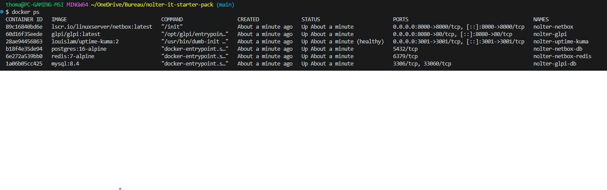

### GLPI

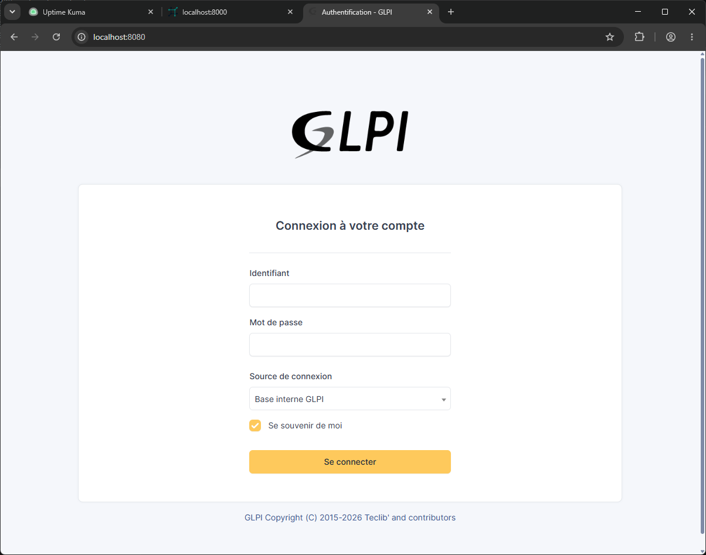

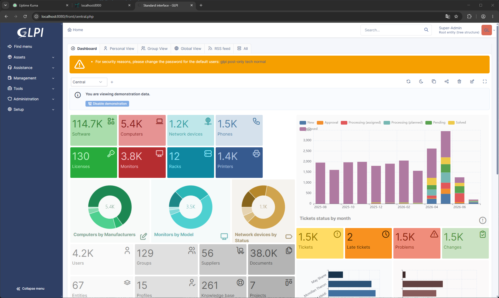

### NetBox

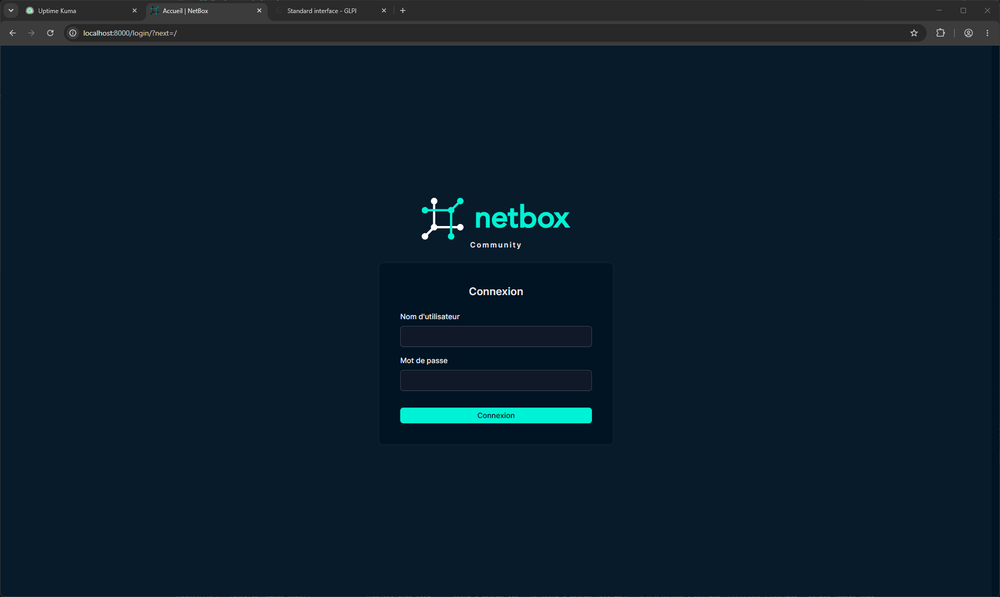

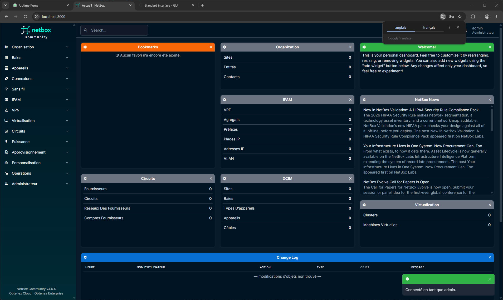

### Uptime Kuma

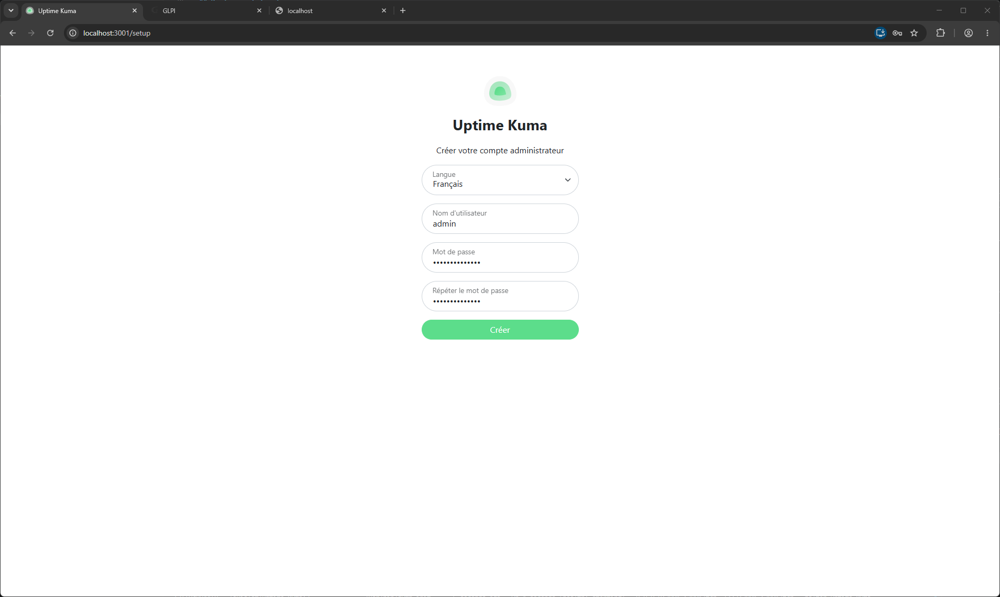

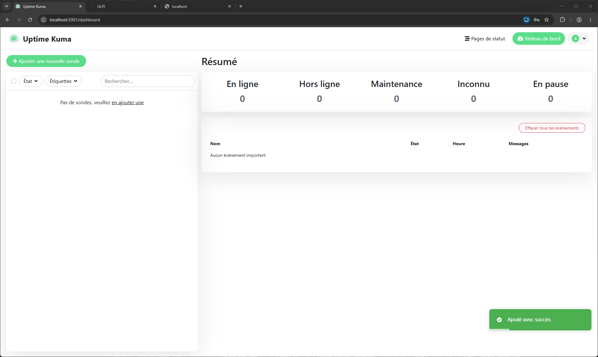

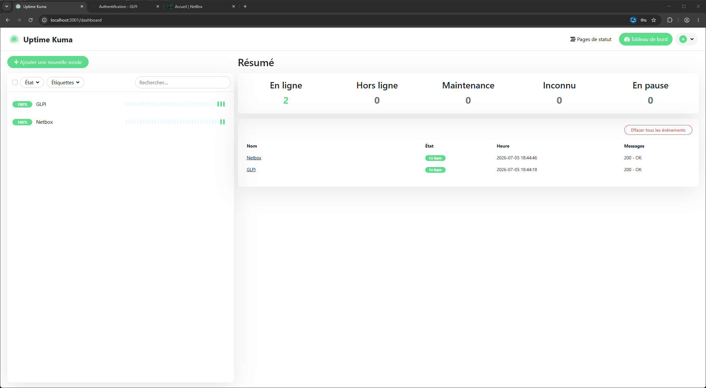

### GitHub Actions

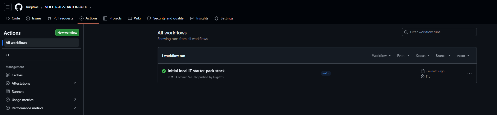

### Monitoring V1.1

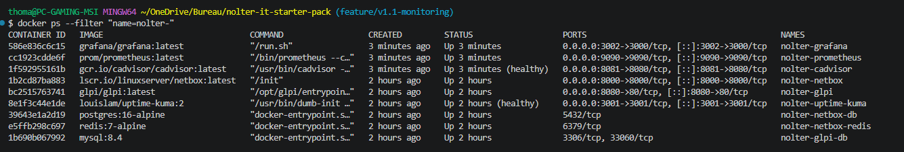

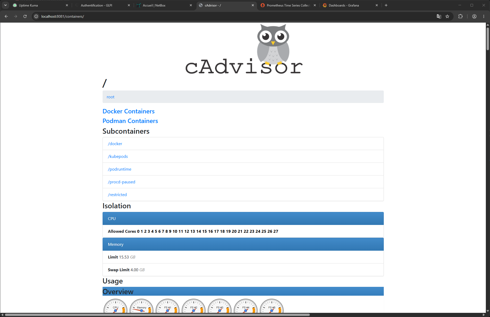

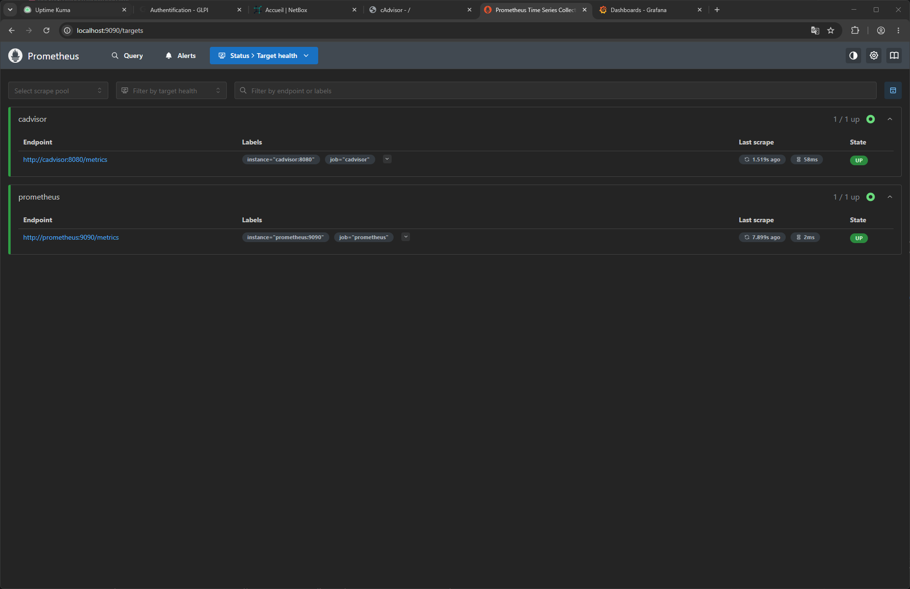

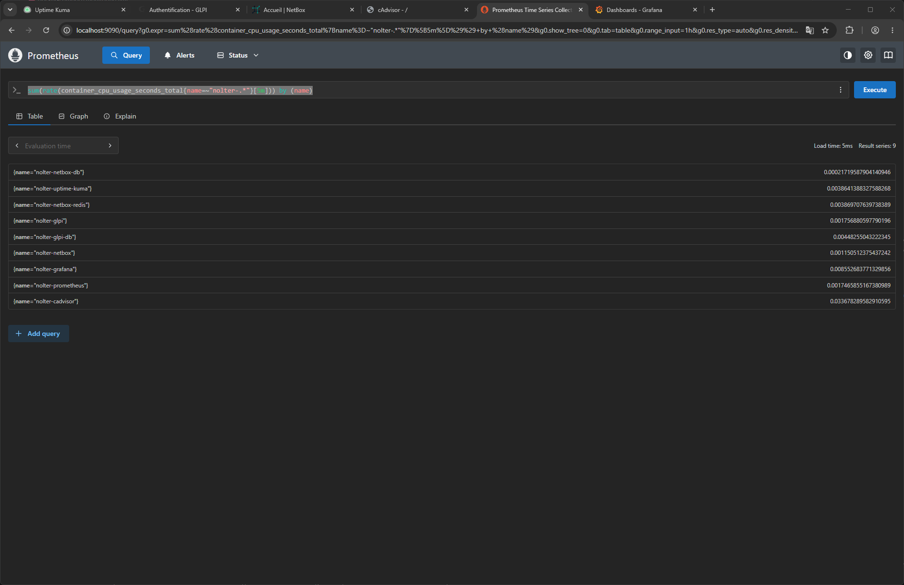

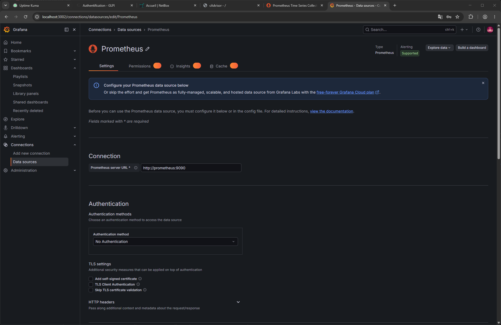

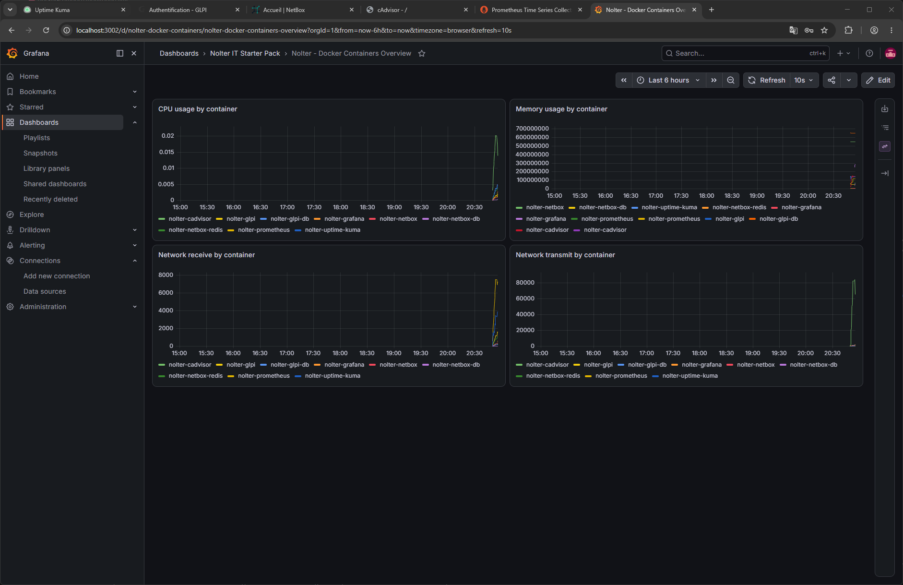

---

## Structure du repository

```text
.
├── .github/
│   └── workflows/
│       └── ci.yml
├── backups/
│   └── .gitkeep
├── config/
│   ├── glpi/
│   ├── netbox/
│   └── uptime-kuma/
├── docs/
│   ├── 01-project-overview.md
│   ├── 02-architecture.md
│   ├── 03-local-deployment.md
│   ├── 04-glpi-first-setup.md
│   ├── 05-netbox-first-setup.md
│   ├── 06-uptime-kuma-monitoring.md
│   ├── 07-backup-and-restore.md
│   ├── 08-roadmap-v1-1-monitoring.md
│   ├── 09-roadmap-v2-cloud.md
│   └── 10-monitoring-v1-1.md
├── monitoring/
│   ├── grafana/
│   │   ├── dashboards/
│   │   │   └── docker-containers-overview.json
│   │   └── provisioning/
│   │       ├── dashboards/
│   │       │   └── dashboards.yml
│   │       └── datasources/
│   │           └── prometheus.yml
│   └── prometheus/
│       └── prometheus.yml
├── screenshots/
├── scripts/
│   ├── backup-glpi.sh
│   ├── backup-netbox.sh
│   ├── logs.sh
│   ├── start.sh
│   ├── status.sh
│   └── stop.sh
├── .env.example
├── .gitignore
├── docker-compose.yml
├── docker-compose.monitoring.yml
├── LICENSE
└── README.md
```

---

## Roadmap

### V1.0 — Stack IT locale

- [x] Créer la structure du repository
- [x] Ajouter Docker Compose
- [x] Ajouter GLPI
- [x] Ajouter MySQL pour GLPI
- [x] Ajouter NetBox
- [x] Ajouter PostgreSQL et Redis pour NetBox
- [x] Ajouter Uptime Kuma
- [x] Configurer Uptime Kuma en SQLite local
- [x] Ajouter la supervision simple GLPI / NetBox avec Uptime Kuma
- [x] Ajouter GitHub Actions
- [x] Tester le déploiement local complet
- [x] Ajouter les screenshots
- [x] Finaliser la documentation V1
- [x] Taguer la version `v1.0.0`

### V1.1 — Supervision conteneurs

- [x] Ajouter Prometheus
- [x] Ajouter Grafana
- [x] Ajouter cAdvisor
- [x] Ajouter un dashboard de supervision des conteneurs
- [x] Ajouter le provisioning automatique Grafana
- [x] Ajouter les screenshots monitoring
- [x] Superviser les conteneurs GLPI, NetBox, Uptime Kuma et les bases de données
- [x] Taguer la version `v1.1.0`

### V2.0 — Déploiement cloud / VPS

- [ ] Préparer un déploiement sur VPS ou cloud
- [ ] Ajouter un reverse proxy
- [ ] Ajouter HTTPS
- [ ] Ajouter sauvegardes planifiées
- [ ] Ajouter documentation d’exploitation

---

## Auteur

Projet réalisé par Luigi THOMAS dans le cadre d’un portfolio orienté administration système, support IT, gestion de parc, documentation infrastructure et DevOps local.

---

## Crédits

Ce projet s’appuie sur des outils open source :

- GLPI
- NetBox
- Uptime Kuma
- MySQL
- PostgreSQL
- Redis
- cAdvisor
- Prometheus
- Grafana

Le repository se concentre sur l’intégration, le déploiement local, la documentation, la supervision et l’automatisation de cette stack IT.